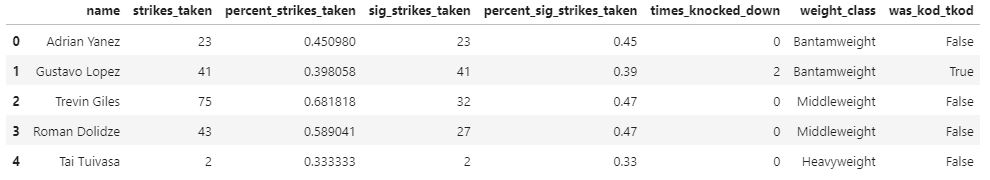
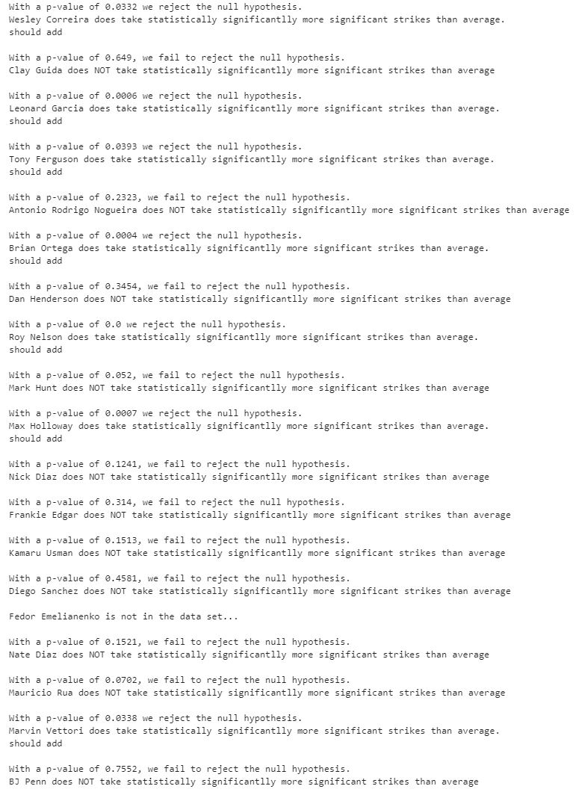
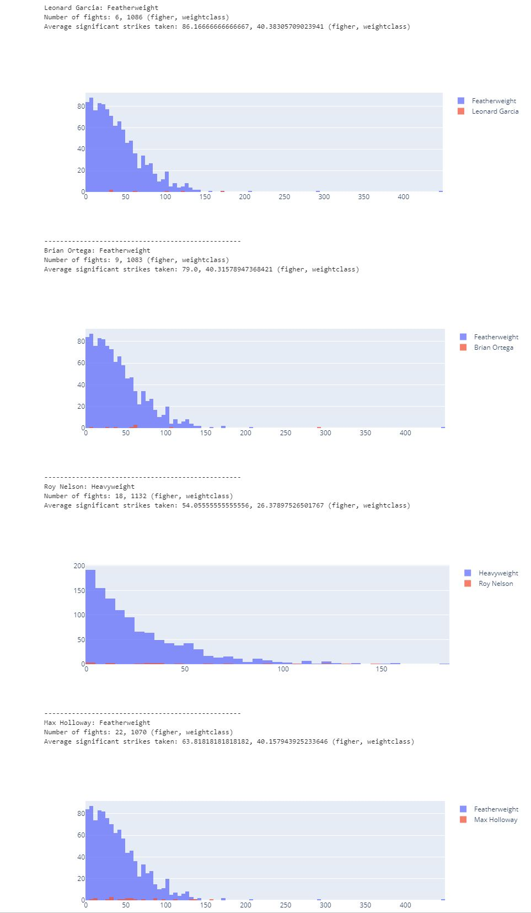

# Intro

In combat sports, some fighters are known for their ability to take strikes and keep going. This is especially true for certain fighters in the UFC. In this paper I aim to test these thoughts to truly see if these prolific fighters are taking more hits than normal. I will be sourcing fighters from these articles [thesportster](thesportster.com/10-toughest-chins-in-ufc-history/), [bleacherreport](https://bleacherreport.com/articles/1464529-mmas-durable-dozen-the-12-most-indestructible-fighters-in-mma-history), and [sportskeeda](https://www.sportskeeda.com/mma/5-most-durable-fighters-ufc). **Disclaimer**: There will be code, you need not understand it. It is simply there so you know I actually did something.
<!---
The intro needs some work
--->

# Data Preprocessing

The data I used comes from [this](https://www.kaggle.com/datasets/rajeevw/ufcdata?resource=download&select=raw_total_fight_data.csv) kaggle dataset. More specifically I used `raw_total_fight_data.csv`. This file looks something like this: 
(if you care about all the values here go to the afformentioned link it's all explained there)

It looks like each row is a fight and information about each fighter that participated in the bout. This is not super useful for us as we only really care about a `fighters name`, `weight class` (since we only compare a given fighter to others in their weight class), and `number of significant strikes taken` **for each fight**. I do parse out a bit more info than that but the fields I stated are all I used for this analysis. Name is simple enough, I can get that from `R_fighter` & `B_fighter`. Significant strikes taken can be obtained from `R_SIG_STR.` & `B_SIG_STR.`. Finally weight class can be obtained from `Fight_type`. This is how I got it:

```python
clean_df = pd.DataFrame(columns=["name", "strikes_taken", "percent_strikes_taken",  "sig_strikes_taken", "percent_sig_strikes_taken", "times_knocked_down", "weight_class", "was_kod_tkod"])
clean_df.head()


def was_ko_tko(row, fighter: str) -> bool:
    if row["win_by"].lower().find("ko") >= 0 and fighter != row["Winner"]:
        return True
    return False


def get_pct(word: str) -> float:
    num = int(word.split()[0])
    denom = int(word.split()[-1])
    if denom != 0:
        return num / denom
    return 0


pattern = re.compile("(UFC )?(.*eight)( Title)? Bout")

for _, row in df.iterrows():
    r_fighter = {
        "name": row["R_fighter"], "strikes_taken": int(row["B_TOTAL_STR."].split()[0]),
        "percent_strikes_taken": get_pct(row["B_TOTAL_STR."]), "sig_strikes_taken": int(row["B_SIG_STR."].split()[0]), 
        "percent_sig_strikes_taken": np.NaN if row["B_SIG_STR_pct"] == "---" else int(row["B_SIG_STR_pct"][:-1]) / 100,
        "times_knocked_down": row["B_KD"], "weight_class": re.match(pattern, row["Fight_type"]).groups()[1] if re.match(pattern, row["Fight_type"]) else np.NaN,
        "was_kod_tkod": was_ko_tko(row, row["R_fighter"]),
    }
    b_fighter = {
        "name": row["B_fighter"], "strikes_taken": int(row["R_TOTAL_STR."].split()[0]),
        "percent_strikes_taken": get_pct(row["R_TOTAL_STR."]), "sig_strikes_taken": int(row["R_SIG_STR."].split()[0]),
        "percent_sig_strikes_taken": np.NaN if row["R_SIG_STR_pct"] == "---" else int(row["R_SIG_STR_pct"][:-1]) / 100,
        "times_knocked_down": row["R_KD"], "weight_class": re.match(pattern, row["Fight_type"]).groups()[1] if re.match(pattern, row["Fight_type"]) else np.NaN,
        "was_kod_tkod": was_ko_tko(row, row["B_fighter"]),
    }
    clean_df = clean_df.append(r_fighter, ignore_index=True)
    clean_df = clean_df.append(b_fighter, ignore_index=True)

clean_df.weight_class = clean_df.weight_class.apply(lambda x: x.replace("Interim ", "") if type(x) == str else x)

clean_df.to_csv("../data/cleaned_data.csv")
```

Like I said I did save more info than I let on **BUT** I only used the fields stated for the analysis.
<!---
Not sure if I want to explain what all the code does
--->
This leaves me with a much tidier dataset that looks like this:


# Project Details

The null hypothesis (H0) is that the average significant strikes taken of a `durable fighter` is the same as the average signigicant strikes taken of all other fighters in their weight class. The alternative hypothesis (H1) is that the average significant strikes taken of a `durable fighter` is higher than that of all other fighters in their weight class. More formally:

**H0**: µ0 = µ1
**H1**: µ0 > µ1
<!---
maybe markdown supports latex. if so i can make this better
--->

Since I didn't explain all the code, let me explain what the resulting data is. For every fight, it seperated out the two fighters, significant strikes taken, and weight class. This means that our current dataset should have an entry for every fight and every fighter so now I can compare means.

# Statistical Analysis

I will be using a `2 idependent sample t-test` for the mean to compare average significant strikes between a `durable fighter` and all other fighters in the weight class and an alpha or .05 as my cutoff for significance.

### Setup

These are the `durable fighters` from the articles:

```python
durable_fighters = [
    "Wesley Correira", "Clay Guida", "Leonard Garcia", "Tony Ferguson", 
    "Antonio Rodrigo Nogueira", "Brian Ortega", "Dan Henderson", "Roy Nelson", 
    "Mark Hunt", "Max Holloway", "Nick Diaz", "Frankie Edgar", "Kamaru Usman", 
    "Diego Sanchez", "Fedor Emelianenko", "Nate Diaz", "Mauricio Rua", 
    "Marvin Vettori", "BJ Penn"
]
```

Given that i have to preform the test on all of the fighters I making 2 helper functions. `seperate` gets data of the fighter into it's own dataframe and data of all other fighters in that weight class into a seperate dataframe (returns false if the fighter not in original data).

```python
def seperate(fighter: str, frame: pd.DataFrame = df) -> tuple[pd.DataFrame] or bool:
    if fighter in frame["name"].unique():
        fighter_data = frame[frame["name"] == fighter]
        most_data_weight_class = fighter_data["weight_class"].value_counts().index[0]
        fighter_data = fighter_data[fighter_data["weight_class"] == most_data_weight_class].copy()
        others_in_weight_class_data = frame[(frame["weight_class"] == most_data_weight_class) & (frame["name"] != fighter)].copy()
        return fighter_data, others_in_weight_class_data
    return False
```

To conduct the test I am using `scipy`. And since the `ttest_ind` function returns an object to make it more interpretable I make a function called `test_sig_str`:

```python
def test_sig_str(fighter_data: pd.DataFrame, class_data: pd.DataFrame) -> bool:
    alpha = .05
    pval = stats.ttest_ind(fighter_data.sig_strikes_taken, class_data.sig_strikes_taken, nan_policy="omit", alternative="greater").pvalue
    if pval < alpha:
        print(f"With a p-value of {round(pval, 4)} we reject the null hypothesis.")
        print(f"{fighter_data.name.iloc[0]} does take statistically significantlly more significant strikes than average.")
        return True
    else:
        print(f"With a p-value of {round(pval, 4)}, we fail to reject the null hypothesis.")
        print(f"{fighter_data.name.iloc[0]} does NOT take statistically significantlly more significant strikes than average")
        return False
```

Now our main routine which will conduct the test on all `durable fighters` is:

```python
for fighter in durable_fighters:
    data = seperate(fighter)
    if data:
        test_sig_str(data[0], data[1])
        print()
    else:
        print(f"{fighter} is not in the data set...\n")
```

And running it we get:


# Discussion

Only 7 out of 18 `durable fighters`, on average, take more significant strikes than all others in their weight class. These fighters are:
```python
['Wesley Correira','Leonard Garcia',
 'Tony Ferguson','Brian Ortega',
 'Roy Nelson','Max Holloway',
 'Marvin Vettori']
```
Less than half the fighters are "durable". This leaves us with 2 options either the populace is bad at judging a fighters durability or this single statistic doesn't tell the whole story. I believe it's the latter. Durability is not a straight forward attribute you can so easily explain in one statistic. The less than perfect results can also be explained by the assumption the t-test. 

1. Data from each group must be independent from one another
2. Data must be normally distributed
3. Variance for the two groups are equal

The only assumption that is followed is that the data is independent. Given that these problems exist within this project, I'd like to come back and find ways to conduct a proper test and find 1 or more statistics that can be used to numerically tell if a fighter is durable or not.

# Prologue

If you looked closely at the results of the spurious test, you may have seen some crazy p-values from these 4:

```python
["Leonard Garcia", "Brian Ortega", "Roy Nelson", "Max Holloway"]
```

TODO: I want to get a deeper look at these guys

### Visualizations for the statistical freaks

